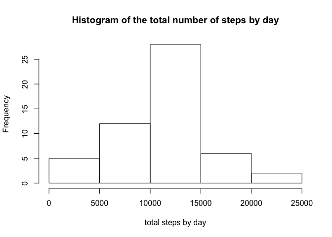

# Reproducible Research: Peer Assessment 1
***
  
# Introduction

It is now possible to collect a large amount of data about personal movement using activity monitoring devices such as a Fitbit, Nike Fuelband, or Jawbone Up. These type of devices are part of the "quantified self" movement -- a group of enthusiasts who take measurements about themselves regularly to improve their health, to find patterns in their behavior, or because they are tech geeks. But these data remain under-utilized both because the raw data are hard to obtain and there is a lack of statistical methods and software for processing and interpreting the data.

This assignment makes use of data from a personal activity monitoring device. This device collects data at 5 minute intervals through out the day. The data consists of two months of data from an anonymous individual collected during the months of October and November, 2012 and include the number of steps taken in 5 minute intervals each day.<br><br><br><br>

# Data

The data for this assignment can be downloaded from the course web site:<br>
<ul>- Dataset: <a href="https://d396qusza40orc.cloudfront.net/repdata%2Fdata%2Factivity.zip">Activity monitoring data</a> [52K]</ul>

The variables included in this dataset are:
<ul>
- steps: Number of steps taking in a 5-minute interval (missing values are coded as NA)
- date: The date on which the measurement was taken in YYYY-MM-DD format
- interval: Identifier for the 5-minute interval in which measurement was taken
</ul>

The dataset is stored in a comma-separated-value (CSV) file and there are a total of 17,568 observations in this dataset.
<br><br><br><br>

# Performed analysis
In this section you will find the description of the questions and the explanations and the code used in order to answer them.
<br><br>

## Environment settings
My first step was to change the locale into English and load some libraries that I found I was going to need. I setted the working directory too, but I found it was pointless to add the code for my directory. If you are going to execute this in your computer, just remember to set the working directory pointing where you had downloaded the data.


```r
Sys.setlocale("LC_ALL","en_GB.UTF-8");
library("dplyr");
```
<br><br>

## Loading and preprocessing the data
First of all, I loaded the data into a format suitable for the analysis. The original file is unzipped and loaded into _activityData_ variable.


```r
untar('activity.zip');
activityData <- read.csv('activity.csv', header = TRUE, sep = ",");
```
<br><br>

## What is mean total number of steps taken per day?
The questions are:<br><br>
<ul>- __Calculate the total number of steps taken per day:__ I use the _aggregate_ function to sum the steps grouping by date. The result is saved into _sumStepsByDate_. Then, I change the names of the columns of this variable into a meaningful ones.</ul><br>
<ul>
- __Make a histogram of the total number of steps taken each day:__ this is performed using the function hist() over the sum of the steps.
</ul><br>
<ul>
- __Calculate and report the mean and median of the total number of steps taken per day:__ using mean() and median() functions
.</ul><br>


```r
sumStepsByDate <- aggregate(activityData$steps, by=activityData["date"], FUN=sum);
names(sumStepsByDate) <- c("date","sumsteps");
hist(sumStepsByDate$sumsteps, main="Histogram of the total number of steps by day", 
     xlab="total steps by day");
```

 

```r
mean(sumStepsByDate$sumsteps, na.rm = TRUE);
```

```
## [1] 10766.19
```

```r
median(sumStepsByDate$sumsteps, na.rm = TRUE);
```

```
## [1] 10765
```


## What is the average daily activity pattern?


## Imputing missing values


## Are there differences in activity patterns between weekdays and weekends?
